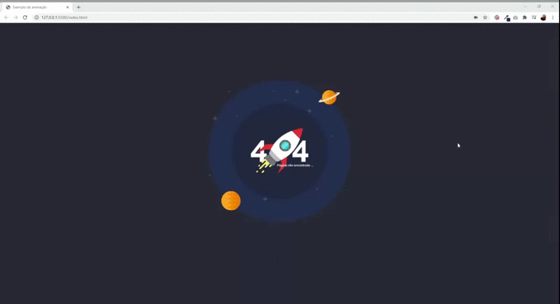

# Como adicionar uma animação do LottieFiles no seu site

<h1 align = center>
    
</h1>

O LottieFiles é uma uma biblioteca iOS, Android e React Native que transforma animações criadas em After Effects em animações para web e aplicativos mobile, tornando a experiência do usuário muito mais rica e agradável.

Para tornar o projeto mais leve, ao invés da inclusão ser realizada com um arquivo .GIF, a plataforma permite que as animações sejam adicionadas aos códigos como um arquivo .JSON, através de extensões open source como o Bodymovin ou o próprio Lottie.

## Como adicionar a animação ao meu projeto? 

